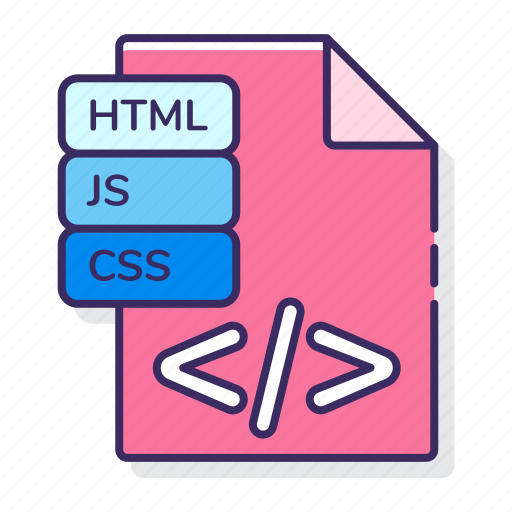

# 📚 Biblioteca de Linguagens

Bem-vindo à minha **Biblioteca de Linguagens** – um repositório dedicado aos arquivos, exercícios e projetos que desenvolvi ao longo da minha jornada acadêmica como programador. Aqui você encontrará desde os primeiros passos com `printf` e estruturas básicas em C até estruturas avançadas como listas encadeadas, árvores binárias, hashing e conceitos iniciais de orientação a objetos.

Este espaço foi criado para **organizar meu progresso, registrar minha evolução e facilitar revisões futuras**, além de servir como um portfólio técnico e fonte de consulta pessoal.

---

📌 **Propósitos deste repositório:**
- Acompanhar minha curva de aprendizado em diferentes linguagens
- Centralizar exercícios resolvidos e práticas guiadas por professores
- Mostrar minha progressão, da base até conceitos mais avançados
- Compartilhar com colegas e professores, como material de referência

---

> ✔️ Cada pasta contém exercícios práticos e arquivos comentados para facilitar a leitura e o estudo posterior.

---

## 💾 Linguagens

	

		<b> 
			
			Aprendendo C
		</b>
	

	<a href="AprendendoLinguagens/C/Estrutura_basica/main.c" style="margin-left:5%">Exercícios básicos</a>	
	 
	<a href="AprendendoLinguagens/C/Estrutura_de_selecao/main.c" style="margin-left:5%">Estrutura de selecao</a>
	 
	<a href="AprendendoLinguagens/C/Estrutura de repeticao/main.c" style="margin-left:5%">Estrutura de Repeticao</a>
	 
	<a href="AprendendoLinguagens/C/Matrizes_E_Vetores/main.c" style="margin-left:5%">Matrizes e Vetores</a>
	 
	<a href="AprendendoLinguagens/C/Modularizacao/main.c" style="margin-left:5%">Modularização</a>
	 
	<a href="AprendendoLinguagens/C/Ponteiros/main.c" style="margin-left:5%">Ponteiros</a>
	 
	<a href="AprendendoLinguagens/C/Alocacao_dinamica_de_memoria/alocacao_em_vetor_dinamico.c" style="margin-left:5%">Alocação Dinâmica de Memória</a>
	 
	<a href="AprendendoLinguagens/C/Lista_encadeada/main.c" style="margin-left:5%">Lista Encadeada</a>
	 
	<a href="AprendendoLinguagens/C/Lista_encadeada_dupla/main.c" style="margin-left:5%">Lista Encadeada Dupla</a>
	 
	<a href="AprendendoLinguagens/C/Lisca_encadeada_FIFO/main.c" style="margin-left:5%">Lista Encadeada FIFO</a>
	 
	<a href="AprendendoLinguagens/C/Lista_encadeada_LIFO/main.c" style="margin-left:5%">Lista Encadeada LIFO</a>
	 
	<a href="AprendendoLinguagens/C/Busca_linear/main.c" style="margin-left:5%">Busca Linear</a>
	 
	<a href="AprendendoLinguagens/C/Busca_binaria/Busca_Binaria.c" style="margin-left:5%">Busca Binaria</a>
	 
	<a href="AprendendoLinguagens/C/Quick Sort" style="margin-left:5%">Quick Sort</a>
	 
	<a href="AprendendoLinguagens/C/Arvore_Busca_Binaria/main.c" style="margin-left:5%">Arvore Busca Binaria</a>
	 
	<a href="AprendendoLinguagens/C/Arvore_Busca_Balanceada/main.c" style="margin-left:5%">Arvore Busca Balanceada</a>
	 
	<a href="AprendendoLinguagens/C/Hashing/hash_varios_dados.c" style="margin-left:5%">Hashing</a>
	 
	<a href="AprendendoLinguagens/C/Orientacao_A_Objetos/main.c" style="margin-left:5%">Orientacao A Objetos</a>
	 

	

		<b> 
			
			Aprendendo GIT - GITHUB
		</b>
	

	<a href="AprendendoLinguagens/GIT-GITHUB/Comandos_Git.mkd" style="margin-left:5%">Comandos</a>
	 

	

		<b> 
			
			Aprendendo Java
		</b>
	

	<a href="AprendendoLinguagens/Java/Vetores/Vetores.java" style="margin-left:5%">Vetores</a>
	 
	<a href="AprendendoLinguagens/Java/Listas/listas.java" style="margin-left:5%">Listas</a>
	 
	<a href="AprendendoLinguagens/Java/Registros/registros.java" style="margin-left:5%">Registros</a>
	 
	<a href="AprendendoLinguagens/Java/Objetos/Tempo.java" style="margin-left:5%">Orientação a objetos</a>
	 
	<a href="AprendendoLinguagens/Java/Heranca/Principal.java" style="margin-left:5%">Heranças</a>
	 
	<a href="AprendendoLinguagens/Java/HashMap/hashMap.java" style="margin-left:5%">HashMap</a>
	 
	<a href="AprendendoLinguagens/Java/Associacao_classes/Contato.java" style="margin-left:5%">Associação entre classes</a>
	 
	<a href="AprendendoLinguagens/Java/Classe_abstrata_polimorfismo/Funcionario.java" style="margin-left:5%">Polimorfismo e abstração</a>
	 
	<a href="AprendendoLinguagens/Java/Conexao_BD/App.java" style="margin-left:5%">Java com Banco de Dados</a>
	 
	<a href="AprendendoLinguagens/Java/Interface_grafica_JSwing/main/Principal.java" style="margin-left:5%">Interfaces gráficas</a>
	 

	

		<b> 
			
			Aprendendo HTML e CSS
		</b>
	

	<a href="AprendendoLinguagens/Html-Css/Botoes_animado" style="margin-left:5%">Botoes animado</a>
	 
	<a href="AprendendoLinguagens/Html-Css/Carousel" style="margin-left:5%">Carrossel de imagens</a>
	 
	<a href="AprendendoLinguagens/Html-Css/Carregamento_neon" style="margin-left:5%">Carregamento neon</a>
	 
	<a href="https://guilhermeamarilho.github.io/Arquivos/AprendendoLinguagens/Html-Css/Carrossel_Imagens" style="margin-left:5%">Carrossel de imagens automático</a>
	 
	<a href="https://guilhermeamarilho.github.io/Arquivos/AprendendoLinguagens/Html-Css/Cartao_flutuante/" style="margin-left:5%">Cartão flutuante</a>
	 
	<a href="https://guilhermeamarilho.github.io/Arquivos/AprendendoLinguagens/Html-Css/Home_netflix" style="margin-left:5%">Home Netflix</a>
	 
	<a href="https://guilhermeamarilho.github.io/Arquivos/AprendendoLinguagens/Html-Css/guilhermeamarilho.github.io" style="margin-left:5%">Primeiro portifólio</a>
	 
	<a href="https://guilhermeamarilho.github.io/Arquivos/AprendendoLinguagens/Html-Css/Navbar_dropOptions" style="margin-left:5%">Navbar com drop</a>
	 
	<a href="https://guilhermeamarilho.github.io/Arquivos/AprendendoLinguagens/Html-Css/Projeto_responsivo_cinema" style="margin-left:5%">Projeto responsivo cinema</a>
	 
	<a href="https://guilhermeamarilho.github.io/Arquivos/AprendendoLinguagens/Html-Css/Seletor_de_cores" style="margin-left:5%">Seletor de cores</a>
	 
	<a href="https://guilhermeamarilho.github.io/Arquivos/AprendendoLinguagens/Html-Css/Social_icon_glass" style="margin-left:5%">Cartão social vitrificado</a>
	 
	<a href="https://guilhermeamarilho.github.io/Arquivos/AprendendoLinguagens/Html-Css/Texto_3d" style="margin-left:5%">Texto 3d</a>
	 

	

		<b> 
			
			Aprendendo JQuery
		</b>
	

	<a href="AprendendoLinguagens/Jquery/Get_Starter/Funcao_base.js" style="margin-left:5%">Introdução</a>
	 
	<a href="AprendendoLinguagens/Jquery/Imprimindo_mensagem/jquery/impressao.js" style="margin-left:5%">Imprimindo mensagem</a>
	 
	<a href="AprendendoLinguagens/Jquery/Animando_div/index.html" style="margin-left:5%">Animações básicas</a>
	 
	<a href="AprendendoLinguagens/Jquery/Manipulacao_eventos/index.html" style="margin-left:5%">Manipulação de eventos</a>
	 
	<a href="AprendendoLinguagens/Jquery/Exemplo_json/Exemplo_dados_artistas.js" style="margin-left:5%">Exemplos de JSON</a>
	 
	<a href="AprendendoLinguagens/Jquery/Carregando_JSon/index.html" style="margin-left:5%">Carregar JSON com JQuery</a>
	 

	

		<b> 
			
			Aprendendo JavaScript
		</b>
	

	<a href="AprendendoLinguagens/Js/Strings/contagem%20de%20letra.html" style="margin-left:5%">Strings</a>
	 
	<a href="AprendendoLinguagens/Js/Numeros_complexos/NumerosComplexos.js" style="margin-left:5%">Numeros complexos</a>
	 
	<a href="AprendendoLinguagens/Js/Exercicios_JS" style="margin-left:5%">Lista de xercicios</a>
	 
	<a href="AprendendoLinguagens/Js/Registros" style="margin-left:5%">Registros</a>
	 
	<a href="AprendendoLinguagens/Js/Objetos" style="margin-left:5%">Orientação de objetos</a>
	 
	<a href="AprendendoLinguagens/Js/Eventos_basico/index.html" style="margin-left:5%">Eventos básico</a>
	 
	<a href="AprendendoLinguagens/Js/Eventos_cinema/trabalhodocinema.html" style="margin-left:5%">Eventos cinema</a>
	 
	<a href="AprendendoLinguagens/Js/GoogleMaps/mapa.html" style="margin-left:5%">API Google Maps</a>
	 
	<a href="AprendendoLinguagens/Js/Projeto_Letroca/trabalho%20letroca.html" style="margin-left:5%">Projeto letroca</a>
	 
	<a href="AprendendoLinguagens/Js/Uno/uno%20modo%202.html" style="margin-left:5%">Projeto final - Uno</a>
	 

	

		<b> 
			
			Aprendendo MarkDown
		</b>
	

	<a href="AprendendoLinguagens/Markdown/Comandos_MarkDown.mkd" style="margin-left:5%">Aprendendo MarkDown</a>

	

		<b> 
			
			Aprendendo SQL
		</b>
	

	<a href="AprendendoLinguagens/Sql/Aprendendo_consultas/lista05.sql" style="margin-left:5%">Aprendendo Consultas</a>
	 
	<a href="AprendendoLinguagens/Sql/Tabela_amigos/Tabela-amigos.sql" style="margin-left:5%">Tabela amigos</a>
	 
	<a href="AprendendoLinguagens/Sql/Tabela_empresa/Tabela-empresa.sql" style="margin-left:5%">Tabela empresa</a>
	 
	<a href="AprendendoLinguagens/Sql/Tabela_escola/SQL-Escola.sql" style="margin-left:5%">Tabela escola</a>
	 
	<a href="AprendendoLinguagens/Sql/Tabela_EuCosinheiro/SQL-eucozinho.sql" style="margin-left:5%">Tabela EuCosinheiro</a>
	 
	<a href="AprendendoLinguagens/Sql/Tabela_EverNote/Tabela-evernote.sql" style="margin-left:5%">Tabela EverNote</a>
	 
	<a href="AprendendoLinguagens/Sql/Tabela_loja/base.sql" style="margin-left:5%">Tabela loja</a>
	 
	<a href="AprendendoLinguagens/Sql/Tabela_produto/tabela-produto.sql" style="margin-left:5%">Tabela produto</a>
	 
	<a href="AprendendoLinguagens/Sql/Tabela_uber/Tabela-uber.sql" style="margin-left:5%">Tabela uber</a>
	 

	

		<b> 
			
			Aprendendo python
		</b>
	

	<a href="AprendendoLinguagens/Python/Comandos_Basicos/main.py" style="margin-left:5%">Comandos básicos</a>
	 
	<a href="AprendendoLinguagens/Python/Entrada_E_Saida/main.py" style="margin-left:5%">Entradas e saidas</a>
	 
	<a href="AprendendoLinguagens/Python/Estrutura_Condicional/main.py" style="margin-left:5%">Estrutura condicional</a>
	 
	<a href="AprendendoLinguagens/Python/Extrutura_De_Repeticao/main.py" style="margin-left:5%">Extrutura de repeticao</a>
	 
	<a href="AprendendoLinguagens/Python/Strings/main.py" style="margin-left:5%">Strings</a>
	 
	<a href="AprendendoLinguagens/Python/Sequencias/main.py" style="margin-left:5%">Sequências</a>
	 
	<a href="AprendendoLinguagens/Python/Listas/main.py" style="margin-left:5%">Listas</a>
	 
	<a href="AprendendoLinguagens/Python/Procedimentos/main.py" style="margin-left:5%">Procedimentos</a>
	 
	<a href="AprendendoLinguagens/Python/Funcoes/main.py" style="margin-left:5%">Funções</a>
	 
	<a href="AprendendoLinguagens/Python/Matrizes/main.py" style="margin-left:5%">Matrizes</a>
	 
	<a href="AprendendoLinguagens/Python/Arquivos/main.py" style="margin-left:5%">Arquivos</a>
	 
	<a href="AprendendoLinguagens/Python/Orientacao_A_Objetos/main.py" style="margin-left:5%">Orientação a objetos</a>
	 
	<a href="AprendendoLinguagens/Python/Arquivos_Com_POO/main.py" style="margin-left:5%">Arquivos com POO</a>
	 
	<a href="AprendendoLinguagens/Python/Bibliotecas/main.py" style="margin-left:5%">Pyxel</a>
	 
	<a href="AprendendoLinguagens/Python/DB_PostgreSQL/main.py" style="margin-left:5%">Banco de dados PostgreSQL</a>
	 
	<a href="AprendendoLinguagens/Python/Bibliotecas" style="margin-left:5%">Bibliotecas para python</a>
	 

